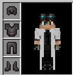
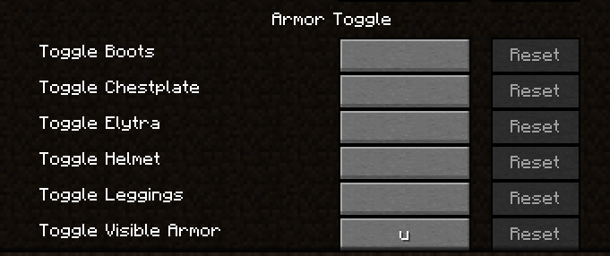
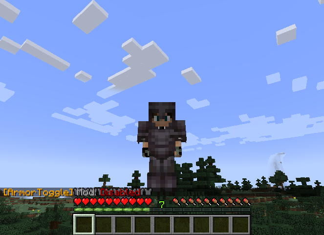

# Fabric Armor Toggle

## Dependencies

This mod requires the Fabric API to be installed (Keybinds) 
https://www.curseforge.com/minecraft/mc-mods/fabric-api/files/all

## Usage

Toggle visibility of armor pieces individually with keybinds. It also remembers your choices! 
Now you can finally hide the armor of your friends and appreciate their skins. 
What you can toggle: 
* The mod itself (Default 'U')
* Helmet
* Chestplate
* Elytra
* Leggings
* Boots

CurseForge:
https://www.curseforge.com/minecraft/mc-mods/fabric-armor-toggle

## Images
 

## License

This template is available under the CC0 license. Feel free to learn from it and incorporate it in your own projects.
